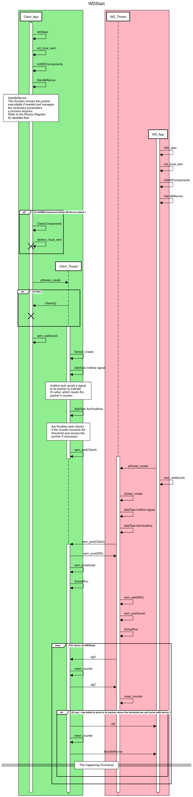

# WatchDog: Robust Process Monitoring and Recovery System

## Overview

WatchDog is a robust, fault-tolerant process monitoring and automatic recovery system implemented in C. It ensures continuous operation of critical applications by detecting failures and automatically restarting them, thereby improving system reliability and uptime.

Developed by [Yeonatan Peleg](https://www.linkedin.com/in/yehonatan-peleg-33b2b2256/), this project demonstrates advanced systems programming concepts including inter-process communication, shared memory management, thread synchronization, and fault tolerance techniques.

## Features

- **Real-time Process Monitoring**: Continuously tracks the health of monitored applications
- **Automatic Recovery**: Instantly restarts crashed processes
- **Configurable Health Checks**: Adjustable monitoring intervals and sensitivity
- **Two-Way Protection**: Mutual monitoring between application and watchdog processes
- **Non-Intrusive Integration**: Simple API to integrate with any application
- **Fault Tolerance**: Resilient to various types of process failures
- **Low Resource Footprint**: Minimal overhead to monitored applications

## Technical Architecture

The WatchDog system uses a dual-process architecture with bi-directional health monitoring:

1. **Client Application Process**: Your main application integrated with the WatchDog API
2. **Watchdog Monitor Process**: A dedicated process that monitors your application

Both processes monitor each other through signals and can revive their partner if it becomes unresponsive. This creates a robust system where even if one process fails, the other can restart it.



### Key Components:

- **Inter-Process Communication**: Uses POSIX semaphores for synchronization
- **Shared Memory**: Facilitates configuration sharing between processes
- **Signals**: SIGUSR1 for health checks, SIGUSR2 for clean termination
- **Scheduler**: Task-based timing for health checks and recovery actions
- **Thread Management**: Multithreaded design for responsive monitoring

## API

The WatchDog API is simple and easy to integrate:

```c
/* Initialize and start the watchdog service */
wd_status_t WDStart(time_t interval_in_sec, size_t intervals_per_check, 
                    int argc, char* argv[]);

/* Gracefully stop the watchdog service */
wd_status_t WDStop(void);
```

### Parameters:

- `interval_in_sec`: Time between health checks (seconds)
- `intervals_per_check`: Number of missed checks before recovery action
- `argc` & `argv`: Command line arguments of the application (used for restarting)

### Return Values:

```c
typedef enum wd_status {
    WD_SUCCESS = 0,
    WD_INIT_FAIL = 1,
    WD_TERMINATION_FAIL = 2,
    WD_MEM_ALLOC_FAIL = 3
} wd_status_t;
```

## Usage Example

```c
#include <stdio.h>
#include "wd.h"

int main(int argc, char *argv[])
{
    wd_status_t status;
    
    /* Start watchdog with 2-second intervals, 3 missed intervals before recovery */
    status = WDStart(2, 3, argc, argv);
    
    if (status != WD_SUCCESS) {
        printf("Failed to start watchdog\n");
        return 1;
    }
    
    /* Your application code here */
    
    /* Stop watchdog before exiting */
    status = WDStop();
    
    return (status == WD_SUCCESS) ? 0 : 1;
}
```

## Building and Running

The project uses a makefile-based build system:

```bash
# Build the project
make debug

# Run tests
make tests
```

## Implementation Details

The implementation showcases several advanced programming concepts:

- **Process Creation and Management**: Using fork() and exec() for process control
- **Signal Handling**: Custom signal handlers for inter-process communication
- **Thread Synchronization**: Mutex and semaphore usage for safe concurrent access
- **Memory Management**: Shared memory segments for configuration sharing
- **Resource Cleanup**: Proper teardown of system resources
- **Error Handling**: Comprehensive error detection and reporting

## About Me

I'm **Yoni Peleg**, a software engineer with expertise in C/C++ development and a passion for full-stack technologies. With a BSc in Information Systems, I enjoy building robust, high-performance systems that solve real-world problems.

My core strengths include:
- **Systems Programming**: Low-level software development with C/C++
- **High-Reliability Systems**: Fault-tolerant and high-availability applications
- **Full-Stack Development**: End-to-end application development
- **Problem Solving**: Analytical approach to complex technical challenges

I'm constantly eager to learn new technologies and methodologies to expand my skill set and tackle challenging projects.

---

Feel free to reach out with questions or collaboration opportunities!
